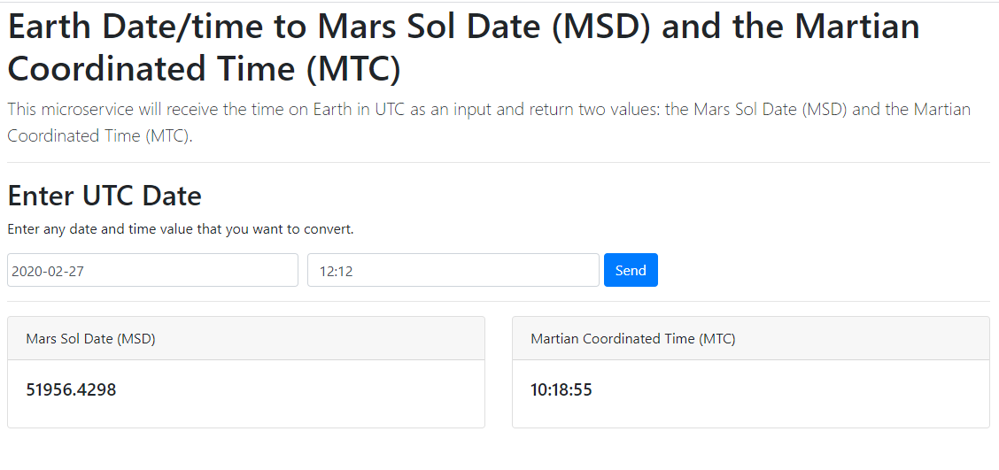
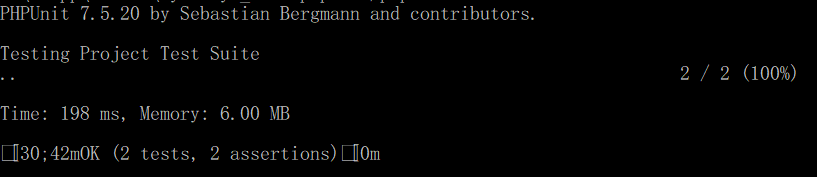

# mars-datetime
This microservice will receive the time on Earth in UTC as an input and return two values: the Mars Sol Date (MSD) and the Martian Coordinated Time (MTC).

# Packages Used

  - Symfony\Bundle\FrameworkBundle
  - FOS\RestBundle\FOSRestBundle
  - JMS\SerializerBundle\JMSSerializerBundle
  - Sensio\Bundle\FrameworkExtraBundle
  - Twig\Extra\TwigExtraBundle
